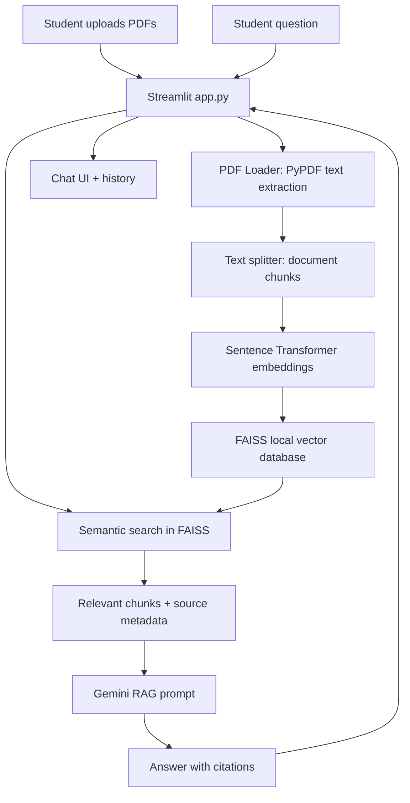

# AI-Powered College Information Assistant

A beginner-friendly full-stack Streamlit project that uses Retrieval-Augmented Generation (RAG) to answer student questions from uploaded college PDFs such as prospectuses, academic regulations, hostel manuals, placement brochures, and notices.

## Features

- Upload one or more PDF documents from the sidebar.
- Extract text page by page with PyPDF.
- Split documents into overlapping chunks for better retrieval.
- Generate local sentence-transformer embeddings.
- Store and load a local FAISS vector database.
- Ask natural language questions in a ChatGPT-style interface.
- Generate grounded answers with Google Gemini.
- Display source document names and page numbers.
- Maintain chat history during the Streamlit session.
- Clear chat history and download chat transcript.
- Toggle dark mode from the sidebar.
- Clear the local document index from the admin dashboard.
- Clean, responsive Streamlit UI.

## Architecture Diagram



## Project Structure

```text
college-rag-chatbot/
├── app.py
├── requirements.txt
├── utils/
│   ├── pdf_loader.py
│   ├── vector_store.py
│   └── rag_pipeline.py
├── data/
├── uploads/
├── README.md
└── .env
```

## Step-by-Step Installation Guide

1. Open a terminal in the project folder.

   ```bash
   cd college-rag-chatbot
   ```

2. Create and activate a virtual environment.

   Windows PowerShell:

   ```powershell
   python -m venv .venv
   .\.venv\Scripts\Activate.ps1
   ```

   macOS or Linux:

   ```bash
   python -m venv .venv
   source .venv/bin/activate
   ```

3. Install dependencies.

   ```bash
   pip install -r requirements.txt
   ```

4. Add your Gemini API key to `.env`.

   ```env
   GOOGLE_API_KEY=your_real_gemini_api_key
   GEMINI_MODEL=gemini-1.5-flash
   ```

5. Run the Streamlit app.

   ```bash
   streamlit run app.py
   ```

6. Open the local Streamlit URL shown in the terminal, usually:

   ```text
   http://localhost:8501
   ```

## How to Use

1. Upload one or more college PDF files from the sidebar.
2. Wait until the app finishes processing documents.
3. Ask a question such as:

   ```text
   What are the hostel rules for first-year students?
   ```

   ```text
   What is the minimum attendance requirement?
   ```

   ```text
   Which companies visited for placements?
   ```

4. Review the generated answer and source document page references.
5. Use **Clear Chat** to reset the conversation.
6. Use **Download Chat History** to save the current discussion.
7. Use **Admin dashboard > Clear Knowledge Base** to remove local uploads and rebuild with new documents.

## Environment Variables

| Variable | Description |
| --- | --- |
| `GOOGLE_API_KEY` | Required Gemini API key. |
| `GEMINI_MODEL` | Optional Gemini model name. Defaults to `gemini-1.5-flash`. |

## Local Storage

- Uploaded PDFs are saved in `uploads/`.
- The FAISS index is saved in `data/faiss_index/`.
- The app rebuilds the index when new PDFs are uploaded in the current session.

## Sample Screenshots

Add screenshots after running the project:

```text
docs/screenshots/sidebar-upload.png
docs/screenshots/chat-answer.png
docs/screenshots/source-citations.png
```

Suggested screenshots:

- Sidebar with uploaded PDF list.
- Chat interface with a student question.
- Assistant answer showing document and page citations.
- Dark mode chat view.
- Download chat history button.

## Project Report Outline

### 1. Title Page

AI-Powered College Information Assistant using Retrieval-Augmented Generation.

### 2. Abstract

Briefly explain the problem of finding information across multiple college documents and how a RAG chatbot solves it.

### 3. Introduction

Describe student information needs, document overload, and the motivation for a conversational assistant.

### 4. Problem Statement

Students often need to search multiple PDFs manually for academic rules, admissions, hostel details, notices, and placement information.

### 5. Objectives

- Build a chatbot that answers from uploaded college documents.
- Use semantic search to retrieve relevant PDF chunks.
- Use Gemini to generate natural answers.
- Display source documents and page numbers for trust.

### 6. Existing System

Manual PDF reading, website searching, notice-board checking, and repeated administrative queries.

### 7. Proposed System

A Streamlit-based RAG assistant that indexes PDFs with FAISS and generates grounded answers using Gemini.

### 8. System Architecture

Include the architecture diagram from this README and explain each module.

### 9. Modules

- PDF upload and storage module.
- Text extraction module.
- Chunking and embedding module.
- FAISS vector search module.
- Gemini answer generation module.
- Streamlit user interface module.

### 10. Tools and Technologies

Python, Streamlit, LangChain, Google Gemini API, FAISS, PyPDF, Sentence Transformers.

### 11. Implementation

Explain `app.py`, `pdf_loader.py`, `vector_store.py`, and `rag_pipeline.py`.

### 12. Testing

Test multiple PDFs, invalid PDFs, missing API key, unrelated questions, and source citation display.

### 13. Results

Include screenshots and sample question-answer pairs.

### 14. Limitations

- Scanned PDFs need OCR before text extraction.
- Answer quality depends on uploaded document quality.
- Gemini API requires internet access and a valid key.

### 15. Future Enhancements

- OCR for scanned documents.
- Admin dashboard for deleting and re-indexing documents.
- Role-based login for students and administrators.
- Department-wise document filtering.
- Cloud deployment.

### 16. Conclusion

Summarize how the assistant improves access to college information and reduces manual searching.

## Troubleshooting

### Missing API Key

If the sidebar shows `Add GOOGLE_API_KEY to .env`, update `.env` with a valid Gemini API key and restart Streamlit.

### FAISS Installation Issue

Use a recent Python version such as Python 3.10 or 3.11. If installation fails, upgrade pip:

```bash
python -m pip install --upgrade pip
pip install -r requirements.txt
```

### Empty Answers from PDFs

The PDF may be scanned image-only. Use OCR software first, then upload the searchable PDF.

## License

This project is intended for academic and final-year project learning purposes.
